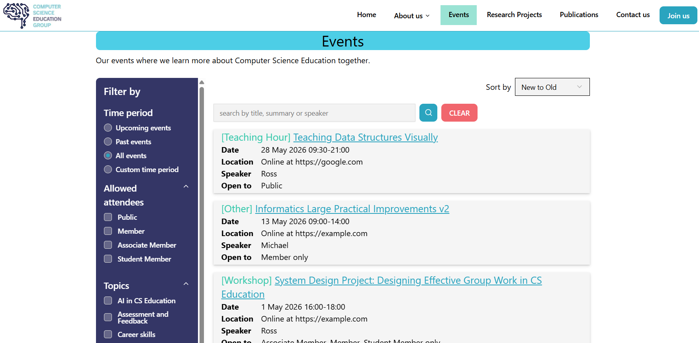

# Previous student notes
This is the frontend for the Computer Science Education Group's new website implemented by Ethan Cheam Kai Jun for his dissertation in 2026.

This is a standard NextJS app so can uses the standard install and run commands. The .env file is for
running locally while .env.vercel is if you need to run it on Vercel for user studies. 

Screenshots:


## Key technical details
1. NextJS in production mode aggressively caches data. When Strapi updates content, the change may not be reflected here unless the cache is refreshed. Currently, this is achieved by Strapi sending a Webhook request to NextJS to refresh everything. See `app/api/revalidate/route.ts`
2. `get-events.ts` and `get-publications.ts` use `fetch` instead of axios get present on other parts. fetch integrates better with NextJS caching than axios so I mulled converting the axios to fetch but I'm not sure if this is necessary. You decide which scheme to use. 
3. When Strapi's Content Type Builder updates a content type, make sure you update the corresponding Zod schemas here.

### Installation
`npm install`

### Development server:
Make sure Strapi is started first
```bash
npm run dev
# or
yarn dev
# or
pnpm dev
# or
bun dev
```

Open [http://localhost:3000](http://localhost:3000) with your browser to see the result.

You can start editing the page by modifying `app/page.tsx`. The page auto-updates as you edit the file.

This project uses [`next/font`](https://nextjs.org/docs/app/building-your-application/optimizing/fonts) to automatically optimize and load [Geist](https://vercel.com/font), a new font family for Vercel.

## Learn More

To learn more about Next.js, take a look at the following resources:

- [Next.js Documentation](https://nextjs.org/docs) - learn about Next.js features and API.
- [Learn Next.js](https://nextjs.org/learn) - an interactive Next.js tutorial.

You can check out [the Next.js GitHub repository](https://github.com/vercel/next.js) - your feedback and contributions are welcome!

## Deploy on Vercel

The easiest way to deploy your Next.js app is to use the [Vercel Platform](https://vercel.com/new?utm_medium=default-template&filter=next.js&utm_source=create-next-app&utm_campaign=create-next-app-readme) from the creators of Next.js.

Check out our [Next.js deployment documentation](https://nextjs.org/docs/app/building-your-application/deploying) for more details.
